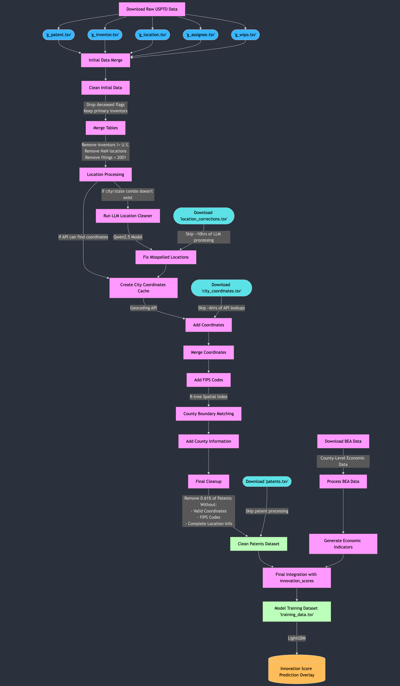

# CSE6242-PatentProject

## Description

This project implements an automated patent data processing and analysis pipeline, designed to identify emerging innovation hubs across the United States. A picture's worth a thousand words, so here's our data cleaning and processing pipeline:



Patent Pulse is an automated pipeline capable of predicting emerging innovation hubs across the United States by analyzing patent data in conjunction with economic indicators. Starting with over 2.5 million USPTO patents filed within the United States since 2001 (a constraint necessitated by the BEA's method of calculating GDP), the pipeline cleans and enriches the data through a complex process involving geolocation correction using a 32B parameter LLM, coordinate mapping, and county-level FIPS code assignment using R-tree spatial indexing based on latitude and longitude. The cleaning process maps 99.39% of patents to their originating counties, providing a robust foundation for geographic analysis that extends well beyond the scope of this one project.

The analytical core of the project is the Innovation Hub Predictor Model (IHPM), which combines patent metrics aggregated over counties (density, diversity, collaboration scores) and economic indicators from the Bureau of Economic Analysis (BEA). Making use of county-level metrics such as GDP, personal income per-capita, employment per-capita, population, and more, we generate an 'innovation score' for each county, each year. We then offset the innovation scores by one period, training a model on our patent data to predict upcoming innovation. Using [LightGBM](https://www.geeksforgeeks.org/lightgbm-light-gradient-boosting-machine/) with a DART boosting strategy, the model achieves an $R^2$ score of 0.802, demonstrating strong predictive power. Our key features include patent activity, technical diversity, regional collaboration, and per-county modifiers based on historical trends and country averages.

The end result is a predictive overlay that identifies potential future innovation hubs across U.S. counties that we've mapped back to coordinates and visualized on a map using Tableau, along with a display of individual patents over time, and a comparison between our predicted `innovation_score`s and the true calculated values for years 2001 to 2022.

## Details

The turquoise nodes with dashed borders in the diagram in the **Description** section represent the 'manual' downloadable files that aren't required for the pipeline but can save significant amounts of time.

</details>

### Data Used (Automatic)

Note that **manual downloading of these files is not required**. Multiple files require specific file locations and naming conventions, so `__init__.py` (and by extension, `main.py`) will download, rename, and move these files automatically to ensure consistency.

|   Source   |           Table Name           | Link                                                                                                                                       |
| :--------: | :----------------------------: | :----------------------------------------------------------------------------------------------------------------------------------------- |
| **USPTO**  |           `g_patent`           | https://s3.amazonaws.com/data.patentsview.org/download/g_patent.tsv.zip                                                                    |
| **USPTO**  | `g_inventor_not_disambiguated` | https://s3.amazonaws.com/data.patentsview.org/download/g_inventor_not_disambiguated.tsv.zip                                                |
| **USPTO**  | `g_location_not_disambiguated` | https://s3.amazonaws.com/data.patentsview.org/download/g_location_not_disambiguated.tsv.zip                                                |
| **USPTO**  | `g_assignee_not_disambiguated` | https://s3.amazonaws.com/data.patentsview.org/download/g_assignee_not_disambiguated.tsv.zip                                                |
| **USPTO**  |      `g_wipo_technology`       | https://s3.amazonaws.com/data.patentsview.org/download/g_wipo_technology.tsv.zip                                                           |
|  **BEA**   | `CAINC1__ALL_AREAS_1969_2023`  | https://apps.bea.gov/regional/zip/CAINC1.zip                                                                                               |
|  **BEA**   | `CAGDP1__ALL_AREAS_2001_2022`  | https://apps.bea.gov/regional/zip/CAGDP1.zip                                                                                               |
|  **BEA**   | `CAINC4__ALL_AREAS_1969_2023`  | https://apps.bea.gov/regional/zip/CAINC4.zip                                                                                               |
|  **BEA**   | `CAINC30__ALL_AREAS_1969_2023` | https://apps.bea.gov/regional/zip/CAINC30.zip                                                                                              |
| **Census** |  `county_boundaries.geojson`   | https://public.opendatasoft.com/api/explore/v2.1/catalog/datasets/us-county-boundaries/exports/geojson?lang=en&timezone=America%2FNew_York |

### Data Used (Manual)

THe following tables should be downloaded manually and placed in their respective directories unless you wish to run the full pipeline (including running a 32B-parameter LLM locally), which can take >24 hours or simply be impossible depending on your device.

You can generate the third file using the first two files, or can download all three and jump straight to generating the BEA features and training the model.

| **Link**                                                                              | **File Location**                         | **Size (MB)** | **Time to Generate (hr)** | **Requires LLM** |
| :------------------------------------------------------------------------------------ | :---------------------------------------- | :-----------: | :-----------------------: | :--------------: |
| https://drive.google.com/file/d/178rhI4UhdwRtPUNkZPrOhQRl5pVFtL1f/view?usp=drive_link | `CSE6242-PatentProject/data/geolocation/` |      1.4      |             6             |        n         |
| https://drive.google.com/file/d/1NPTZyfcBFptAvhmcSngn_Fo8VhfT9Gi-/view?usp=drive_link | `CSE6242-PatentProject/data/geolocation/` |      0.8      |            10             |        y         |
| https://drive.google.com/file/d/18AX7vQeApAuCK2KgTLUACeJf36D2Band/view?usp=drive_link | `CSE6242-PatentProject/data/`             |     913.6     |            0.4            |        n         |

## Installation and Setup

Follow these steps to set up the project:

1. Clone the repository:

```
git clone https://github.com/AidanAllchin/CSE6242-PatentProject.git
cd CSE6242-PatentProject
```

2. Create and activate a new virtual environment:

```
python -m venv venv
source venv/bin/activate  # On Windows, use venv\Scripts\activate
```

OR use `conda`, `mamba`, or another environment manager.

3. Install required packages:

```
pip install -r requirements.txt
```

## Usage

1. Switch to your new python environment and run:

```
python main.py
```

2. **_Before selecting a menu option,_** if interested in downloading one of the intermediate files (`city_coordinates.tsv`, `location_corrections.tsv`, and `patents.tsv`) to save time, do so now and place them in the newly created appropriate directory.

3. The script `python main.py` will walk through the entire project. The menu items are designed to be run sequentially.

This script will:

- Install required packages if needed
- Create necessary directories
- Download all required tables
- **Menu Item 1:** Merge all tables
- **Menu Item 1:** Perform all data cleaning steps
- **Menu Item 1:** Add latitude and longitude for inventor and assignee to each patent
- **Menu Item 1:** Add inventor origination county information to every patent based on coordinates
- **Menu Item 1:** Generate a `patents.tsv` file with all US-based patents since 2001 (this time constraint is due to GDP data being unavailable per-county prior to this)
- **Menu Item 2:** Load BEA data
- **Menu Item 3:** (Unused) Load census data
- **Menu Item 4:** (Unused) Load Fed data
- **Menu Item 5:** Group patents and create model metrics organized by time window and county
- **Menu Item 5:** Create predictors and `innovation_score` for the Innovation Hub Predictor
- **Menu Item 6:** Train IHPM and predict next period innovation score for all counties for overlay
- **Menu Item 6:** Add latitude and longitude for the predicted values back to the data for the overlay

## Known Issues

The BEA tables downloaded in `__init__.py` update once annually, and have done so since starting the project. This year, the BEA changed the schema within some of the files, changing the process for calculating `innovation_score`s significantly. This would be worth addressing, except `CAGDP1__ALL_AREAS_2001_2022` contains the GDP information per-county (one of our most important metrics) and unlike the other files (updated on November 14th), will next update on December 4th. This makes any changes to adopt the new version infeasible, as the data we're pulling will change after turning the project in.

To circumvent this, I've uploaded the 2022 versions of the necessary files to Google Drive, and the script will download these older tables by default.
